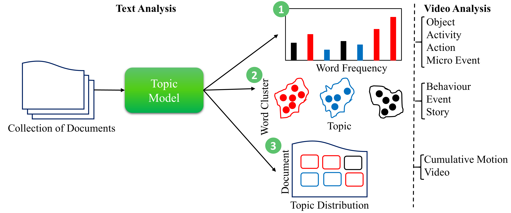

### Publication
R.Pal, A.Ahmed, D.P.Dogra, S.Kar, D.P.Prasad, Topic-based Video Analysis: A Survey(Accepted  in ACM Computing Surveys
[Link to The Paper](XXXXXXX)

### Abstract
Manual processing of a large volume of video data captured through CCTV is challenging due to various reasons. Firstly, manual
analysis is highly time-consuming. Moreover, as surveillance videos are recorded in dynamic conditions such as in the presence
of camera motion, varying illumination, or occlusion, conventional supervised learning may not work always. Thus, computer
vision-based automatic surveillance scene analysis is carried out in unsupervised ways. Topic modelling is one of the emerging
fields used in unsupervised information processing. Topic modelling is used in text analysis, computer vision applications, and other
areas involving spatio-temporal data. In this paper, we discuss the scope, variations, and applications of topic modelling, particularly
focusing on surveillance video analysis. We have provided a methodological survey on existing topic models, their features, underlying
representations, characterization, and applications in visual surveillance’s perspective. Important research papers related to topic
modelling in visual surveillance have been summarized and critically analyzed in this paper.

### License

Copyright © 2021 Ratnabali Pal

The content of this repository is bound by the following licenses:

- The documents and data are licensed under the MIT license.
